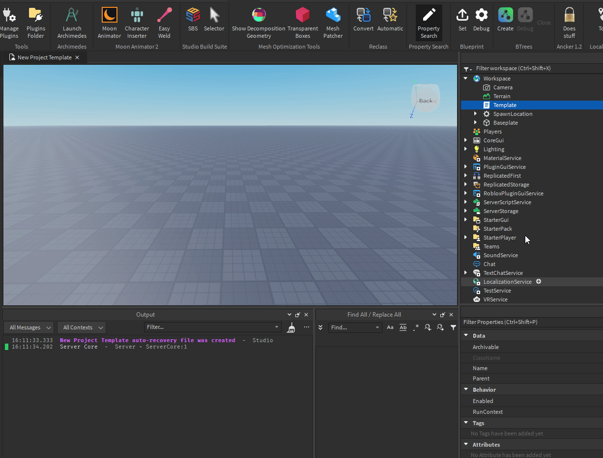

<h1 align="center">Blueprint</h1>
  

    a Roblox Studio plugin designed to replace the default script sources with a dedicated template seamlessly
  

    <a href="https://github.com/OssieNomae/Blueprint">Github</a>
    ·
    <a href="https://create.roblox.com/store/asset/16867958047/Blueprint">Creator Marketplace</a>
    ·
    <a href="https://devforum.roblox.com/t/2889700">Devforum</a>
  

## Installation
### [Creator Marketplace 🖱️](https://create.roblox.com/store/asset/16867958047/Blueprint)
_The Creator Marketplace is the easiest way to install Blueprint. You'll get access to automatic updates and be able to use the plugin anywhere you have Roblox Studio installed._

### Manual Installation
1. Download the plugin (.rbxmx) file from [Releases](https://github.com/OssieNomae/Blueprint/releases)
2. Drag and Drop the plugin file into the Roblox Studio "Plugins Folder" _(TopBar -> Plugins -> Plugins Folder)_

## Usage
1. Select a "Script" Instance in the Roblox Studio "Explorer" with the desired source template
2. From the Studio TopBar go to "Plugins" -> "Blueprint" Toolbar -> "Set" Button

Now, create a new script instance to witness the source get changed!

 

  

