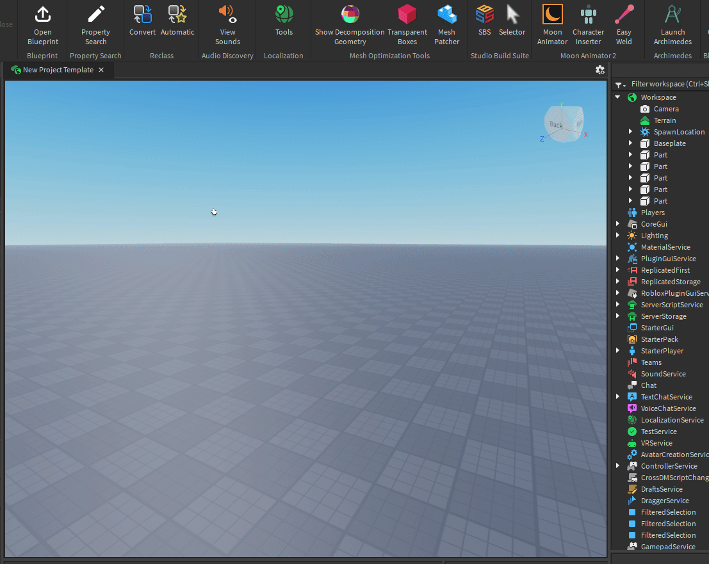

# Blueprint
Simple Roblox Studio plugin to automatically replace the default script source with a template

# Installation
The Creator Marketplace is the easiest way to install Blueprint. You'll get access to automatic updates and be able to use the plugin anywhere you have Roblox Studio installed.
### [Creator Marketplace](https://create.roblox.com/store/asset/16867958047/Blueprint)

### Manual Installation
```md
- Download the plugin (.rbxmx) file from Releases
- Drag and Drop the plugin file into the Roblox Studio "Plugins Folder" (TopBar -> Plugins -> Plugins Folder)
```

## Usage
```md
- Select a "Script" Instance in the Roblox Studio "Explorer" with the desired source template
- From the Studio TopBar go to "Plugins" -> "Blueprint" Toolbar -> "Set" Button
- All Done!
```
<p>
  <a href=""></a>
</p>
